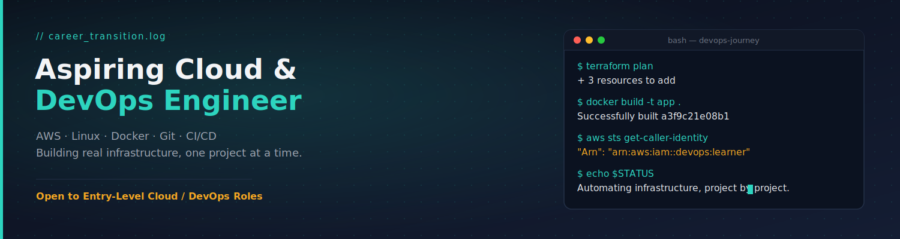

# ☁️ AWS & DevOps Journey
This repo documents my hands-on journey learning **AWS, Linux, Git, Docker, and CI/CD** as I transition into a DevOps career. Instead of just following tutorials, I'm using this repo to track what I build, what breaks, and what I learn from fixing it.
---
## 🎯 Goal
Land an entry-level **DevOps / Cloud Engineer** role by building real, working infrastructure and automation projects — not just certificates.
---
## 🗺️ Roadmap
| Stage | Topic | Status |
|-------|-------|--------|
| 1 | Linux fundamentals & shell scripting | ✅ In progress |
| 2 | Git & GitHub workflows | ✅ In progress |
| 3 | AWS core services (EC2, S3, IAM, VPC) | 🔄 Learning |
| 4 | Docker — containerizing applications | 🔄 Learning |
| 5 | CI/CD with GitHub Actions | 🔄 Learning |
| 6 | Terraform — Infrastructure as Code | ⬜ Planned |
| 7 | Kubernetes — orchestration | ⬜ Planned |
| 8 | Monitoring (CloudWatch / Prometheus) | ⬜ Planned |
---
## 📁 Projects in this journey
### 1. [Linux Server Setup & Scripting](./linux-basics)
Basic Linux administration tasks: user management, file permissions, cron jobs, and a few automation scripts written in Bash.
### 2. [AWS EC2 + S3 Static Site](./aws-static-site)
Deployed a static website using an S3 bucket, and set up an EC2 instance to explore SSH access, security groups, and IAM roles.
### 3. [Dockerized Sample App](./docker-app)
Took a simple app and containerized it with Docker — wrote the Dockerfile, built the image, and ran it locally.
### 4. [CI/CD with GitHub Actions](./ci-cd-pipeline)
Set up a GitHub Actions workflow that runs on every push: lints code, runs tests, and builds a Docker image.
*(Update the links above once each sub-project folder exists — even a single script + its own mini-README counts as a project.)*
---
## 📝 What I'm learning as I go
I'm keeping notes here on real problems I ran into and how I solved them — this is often more valuable to show than the finished project itself.
- **Example:** *"My EC2 instance couldn't connect via SSH — turned out my security group didn't allow inbound traffic on port 22 from my IP. Fixed by adding an inbound rule."*
- **Example:** *"Docker build was failing due to a missing dependency in requirements.txt — learned to always test builds locally before pushing to CI."*
*(Replace these with your own real notes as you hit and solve real issues — this is what shows genuine hands-on experience.)*
---
## 🛠️ Tools & Tech Used

---
## 📬 Connect
If you're on a similar journey or hiring for DevOps roles, feel free to reach out!
- LinkedIn: (https://www.linkedin.com/in/samir-maji-devops-aws/)
- Email: samirmaji348@gmail.com
---
⭐ *This repo is a living document — updated as I learn and build. Star it if you find it useful for your own journey!*
